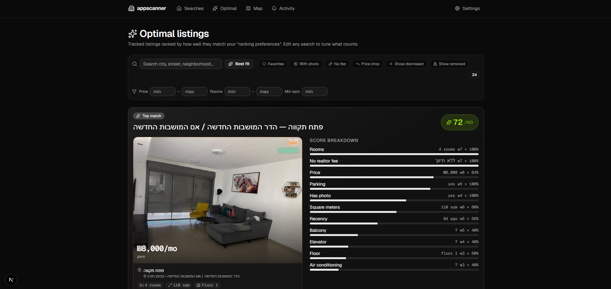

# appscanner

> Real-time apartment-listing aggregator for the Israeli rental market.
> Scans **Yad2** + **Onmap** every 15 minutes, ranks listings against your preferences, and pushes alerts to **Telegram** with one-tap **WhatsApp** deep-links.



[](https://nextjs.org)
[](https://www.typescriptlang.org)
[](https://supabase.com)
[](https://vercel.com)
[](LICENSE)

---

## What it does

- **Multi-source scraping** — Yad2 (via ScraperAPI proxy to bypass Radware) and Onmap (direct).
- **15-minute scan cadence**, driven by a Supabase `pg_cron` job hitting `/api/scan`.
- **Per-listing dedup** — only **net-new** listings produce alerts, no flood when filters change.
- **Smart filtering** — hard filters (rooms, price, neighborhood substring, amenities) plus soft preferences for ranking.
- **Reverse-geocoding** — listings without a neighborhood field have their coordinates reverse-resolved via OSM Nominatim so strict hood filters still catch them.
- **Market-fit scoring** — proximity to ideal price / sqm / rooms / floor + weighted amenity bonuses + freshness decay.
- **Per-city ₪/sqm stats** — every alert shows the listing's ₪/m² against the local mean (z-score band).
- **Telegram alerts** — one message per listing with photo, neighborhood, price-vs-market, agency badge, amenity icons, owner phone + prefilled WhatsApp link (Onmap only — Yad2 hides owner phone behind authenticated reveal), and 🔗 deep-link back to the source listing.
- **Multi-chat fan-out** — alerts can target your DM + a shared group.
- **Active hours** — pauses scans outside configured local-time window (e.g. 8 AM–11 PM IL).
- **Dashboard** — search browser, optimal-match ranking with score breakdown, map view with clustering, listing-creation flow chart, notifications history.

---

## Architecture

```
┌─────────────────────────┐      ┌────────────────────────────┐
│ Supabase pg_cron        │──────▶ Vercel: /api/scan          │
│  */15 * * * *           │      │  (Next.js App Router)      │
└─────────────────────────┘      └──────────────┬─────────────┘
                                                │
              ┌─────────────────────────────────┼─────────────────────────────────┐
              ▼                                 ▼                                 ▼
   ┌──────────────────────┐         ┌──────────────────────┐         ┌─────────────────────┐
   │ Yad2 feed            │         │ Onmap feed           │         │ Reverse-geocode     │
   │ (via ScraperAPI)     │         │ (direct)             │         │ (OSM Nominatim)     │
   └──────────┬───────────┘         └──────────┬───────────┘         └──────────┬──────────┘
              └─────────────────────────────────┴────────────────────────────────┘
                                                │
                                                ▼
                                ┌───────────────────────────────┐
                                │ Dedup vs Supabase seen_listings│
                                │ → events (new / price_drop)   │
                                └────────────────┬──────────────┘
                                                 ▼
                          ┌────────────────────────────────────────┐
                          │ Telegram Bot API                       │
                          │  ▸ fan-out to primary + extra chats    │
                          │  ▸ per-listing photo + caption         │
                          └────────────────────────────────────────┘
```

### Storage (Supabase)

| Table | Purpose |
|---|---|
| `searches` | Search configs (filters, preferences, active-hours, interval) |
| `settings` | Telegram bot token + chat IDs (single-row, `id = 1`) |
| `seen_listings` | Dedup state per (search, source, token) — full snapshot + price history |
| `notifications` | Alert log (sent / failed / logged) |
| `scan_runs` | Per-source-per-scan metrics (fetched, new, error, duration) |

---

## Tech stack

- **Frontend**: Next.js 16 App Router, React 19, Tailwind 4, shadcn/ui on Base UI, Leaflet for maps
- **Backend**: Next.js server actions + API routes (Fluid Compute), TypeScript
- **DB**: Supabase Postgres + `pg_cron` + `pg_net` for triggers
- **Hosting**: Vercel (Hobby tier)
- **Scraping proxy**: ScraperAPI free tier (5000 req/mo, covers Yad2 only — Onmap is direct)
- **Geo**: OpenStreetMap Nominatim (free reverse-geocoding)
- **Notifications**: Telegram Bot API

---

## Setup

### Prerequisites

- Node 20+ (Vercel runs on Node 24)
- A free [Supabase](https://supabase.com) project (any region)
- A [Telegram bot](https://t.me/BotFather) (`/newbot`) and your chat ID
- (Optional, for Yad2) A [ScraperAPI](https://scraperapi.com) free-tier API key
- (Optional) [Vercel](https://vercel.com) account for hosting

### Install

```bash
git clone https://github.com/roeimichael/appscanner.git
cd appscanner
npm install
```

### Configure

Copy `.env.local.example` to `.env.local` and fill in:

```bash
SUPABASE_URL=https://<your-project-ref>.supabase.co
SUPABASE_SERVICE_ROLE_KEY=sb_secret_xxx
SCRAPERAPI_KEY=xxx           # optional — only needed for Yad2
CRON_SECRET=<random-hex>     # protects /api/scan from open access
```

### Schema

Apply `supabase/migrations/init_appscanner_schema.sql` to your Supabase project,
then enable the cron extensions:

```sql
create extension if not exists pg_cron with schema extensions;
create extension if not exists pg_net  with schema extensions;
```

### Telegram

1. Talk to [@BotFather](https://t.me/BotFather), `/newbot`, save the token.
2. Send any message to your new bot.
3. Hit `https://api.telegram.org/bot<TOKEN>/getUpdates` and grab the `chat.id`.
4. Save both via the `/settings` page once the app is running.

### Run

```bash
npm run dev
# open http://localhost:3000
```

### Deploy

```bash
vercel link
vercel env add SUPABASE_URL              production
vercel env add SUPABASE_SERVICE_ROLE_KEY production
vercel env add SCRAPERAPI_KEY            production
vercel env add CRON_SECRET               production
vercel deploy --prod
```

### Scheduling

Vercel Hobby caps cron to one fire/day. To run every 15 min, schedule from Supabase:

```sql
select cron.schedule(
    'appscanner-scan-15min',
    '*/15 * * * *',
    $cron$
    select net.http_post(
        url := 'https://<your-deployment>.vercel.app/api/scan',
        headers := jsonb_build_object('Authorization', 'Bearer <CRON_SECRET>'),
        body := '{}'::jsonb,
        timeout_milliseconds := 290000
    );
    $cron$
);
```

After deploy, run `/api/scan?force=1&bootstrap=1` once to populate `seen_listings` **silently** (no Telegram flood from the initial backfill).

---

## How matching works

### Hard filters (drop listings that fail)

- City + region (Yad2 numeric ID)
- Rooms range (e.g. 4–5.5)
- Price range
- Neighborhoods (substring match against `listing.neighborhood`; reverse-geocoded if blank)
- Property type, amenities (parking, elevator, balcony, …)
- `excludeAgency`, `imageOnly`, `priceOnly`

### Soft preferences (rank only, don't exclude)

Each preference has an **ideal value** and a **weight 0–10**:

| Factor | Behavior |
|---|---|
| `idealPrice`, `idealSqm`, `idealRooms`, `idealFloor` | Gaussian proximity — closer = higher score |
| `weightAgencyFee` | Bonus for `isAgency === false` (no realtor) |
| `weightImage` | Bonus when a photo is present |
| `weightFreshness` | Linear decay over 14 days from `createdAt` (falls back to `firstSeenAt`) |
| `weightParking`, `weightElevator`, … | Bonus when amenity is true |

Final score = `Σ(weight × value) / Σ(weight) × 100`, range 0–100.

### Per-city ₪/sqm comparison

For every alert, the listing's ₪/m² is compared to the rolling mean of that city's tracked listings. The Telegram message includes the absolute ratio and a band tag (top-25% = cheap, bottom-25% = pricey).

A "🔥 hot deal" header is applied when a listing is **private AND priced ≥10% below city mean** (`z ≤ -0.4`).

---

## Routes

| Route | Purpose |
|---|---|
| `GET /api/scan?force=1&bootstrap=1` | Manual scan trigger (also cron entrypoint) |
| `GET /api/searches` / `POST` | List + create searches |
| `PATCH /api/searches/[id]` | Update / enable / disable a search |
| `GET /api/listings` | All tracked listings + sort/filter |
| `GET /api/optimal` | Listings ranked by score |
| `GET /api/listing-flow?range=24h\|7d\|30d` | Histogram of listing post times |
| `GET /api/activity` | Daily new-listing buckets + source health |
| `GET /api/neighborhoods?cityId=N` | Yad2 hood catalog for a city (letter-sweep + 30-day cache) |
| `GET /api/cities` | Catalog of supported Israeli cities |
| `GET /api/notifications` | Alert log |

---

## Limitations & known issues

- **Yad2 owner phones are not extractable.** The phone reveal flow is authenticated (session + CSRF). The static HTML contains only Yad2's own corporate share-WhatsApp number, which is wrong. Alerts include a 🔗 deep-link instead — one tap in Yad2's UI reveals the real number.
- **Onmap inventory in tight hood filters can be very thin.** Most PT inventory on Onmap clusters in different hoods than the user-specified set.
- **Vercel Hobby cron** caps at one fire/day → we trigger from Supabase pg_cron instead.
- **ScraperAPI free tier** is rate-limited and lacks `instruction_set` — required for clicking phone-reveal buttons. Yad2 phone reveal would need a paid tier.

---

## License

MIT — see [LICENSE](LICENSE).

---

## Acknowledgements

- [Yad2](https://yad2.co.il) and [Onmap](https://onmap.co.il) for the listings.
- [Supabase](https://supabase.com) for the database + cron.
- [Vercel](https://vercel.com) for hosting.
- [shadcn/ui](https://ui.shadcn.com) for the component primitives.
- [ScraperAPI](https://scraperapi.com) for Yad2 proxying.
- [OpenStreetMap Nominatim](https://nominatim.openstreetmap.org) for reverse-geocoding.
